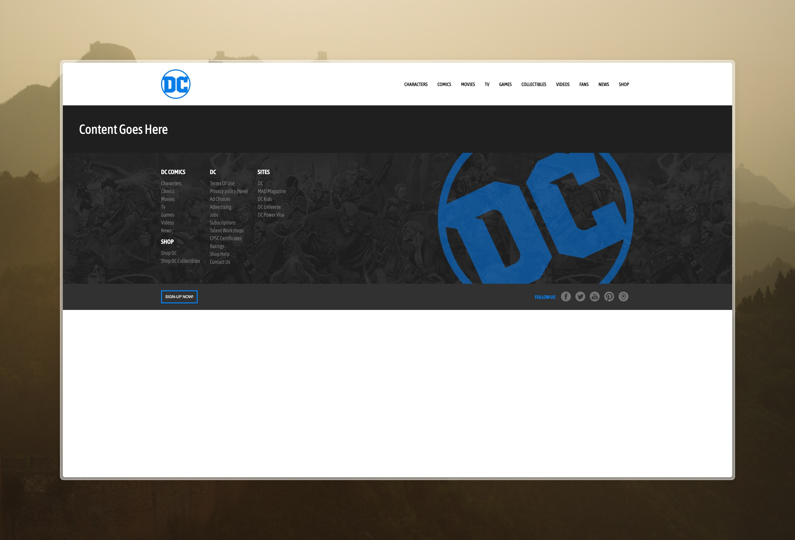

# DC Comics

Progetto con Vite, Vue e Scss in cui dobbiamo riprodurre il sito della DC

### Aggiornamento 1

Ho strutturato il progetto in 3 componenti principali quali Header Main e FOoter, ai quali interno ci metterò ulteriori componenti piú piccoli.
Per ora ho fatto l'header con il menù, gestendo la lista di link come componente a parte poi inserito nell'header.

La lista l'ho generata con un v-for ma per ora non ho inserito il tag `<a>` preferisco farlo successivamente in caso sia effettivametne un link e debba funzionare.

Ho preferito evitare di usare bootstrap per prendere familiarita con l'SCSS

### Aggiornamento 2

Ho aggiunto i componenti per il footer.

All'interno del footer ho inserito un sotto componente `DownList`che altro non é se non la lista di info nel footer.
Dopo aver messo il logo di fianco ho creato un altro sottocomponente che é la parte finale del footer con i social e il bottone.
Ho usato degli oggetti con v for per generare sia le icone che le info.

Il sito attualmente ha hover su tutti i link dei social, sul pulsante follow, sul menú dell'header e sulle info.

In questo stato il sito si presenta cosí:

### Aggiornamento 3

Ho aggiunto la sezione dello shop, generandola dinamicamente con v for, ci ho messo anche un effettino di hover sopra che fa diventare l'immagine e il testo neri, in caso non fosse necessaria la rimuoveró

## Aggiornamento 4

Per aggiungere dinamicamentye la sezione dei fumetti:

-Ho utilizzato v-for per iterare sull'array comics e generare dinamicamente un contenitore per ogni fumetto.

-Ho impostato l'attributo key nel ciclo v-for su comic.series per assicurarmi che ogni elemento sia unico e Vue.js possa gestire il DOM in modo efficiente.

-Ho udsto calc(100% / 6) per mettere le copertine dei fumetti in riga, dato che ne voglio 6 per riga.

-Ho aggiunto align-items: center; e justify-content: center; per centrare i contenitori dei fumetti.
